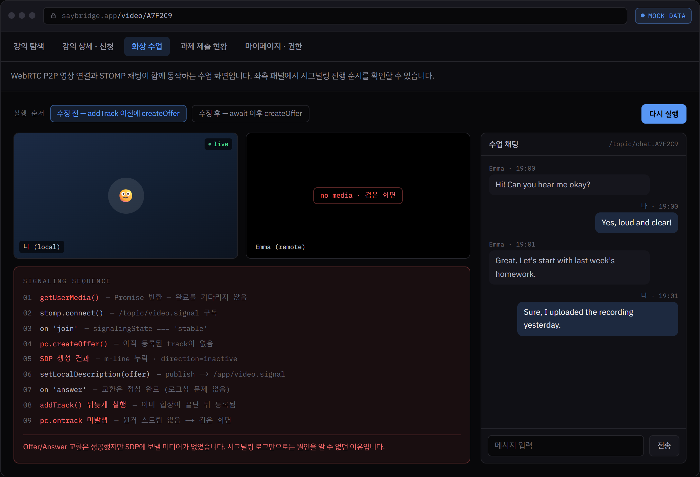
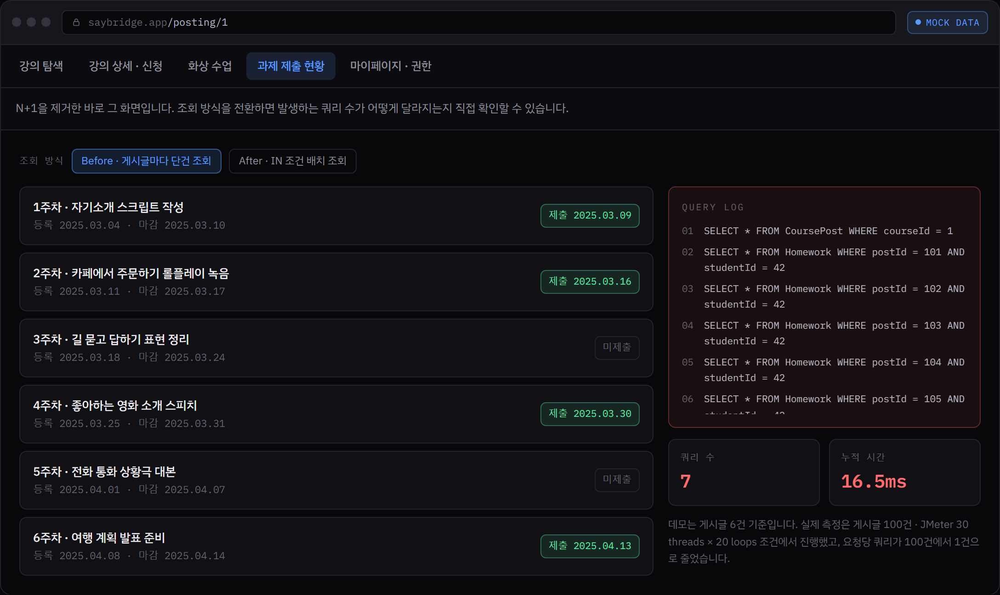
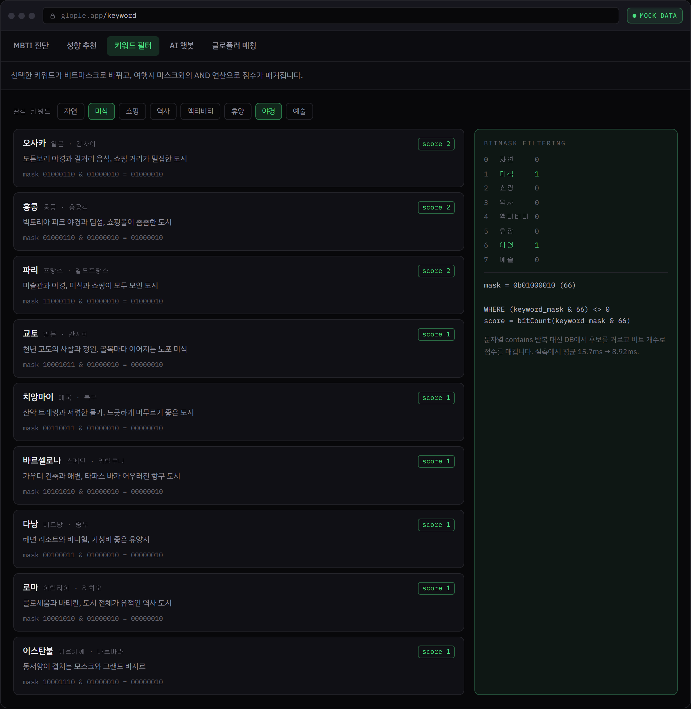
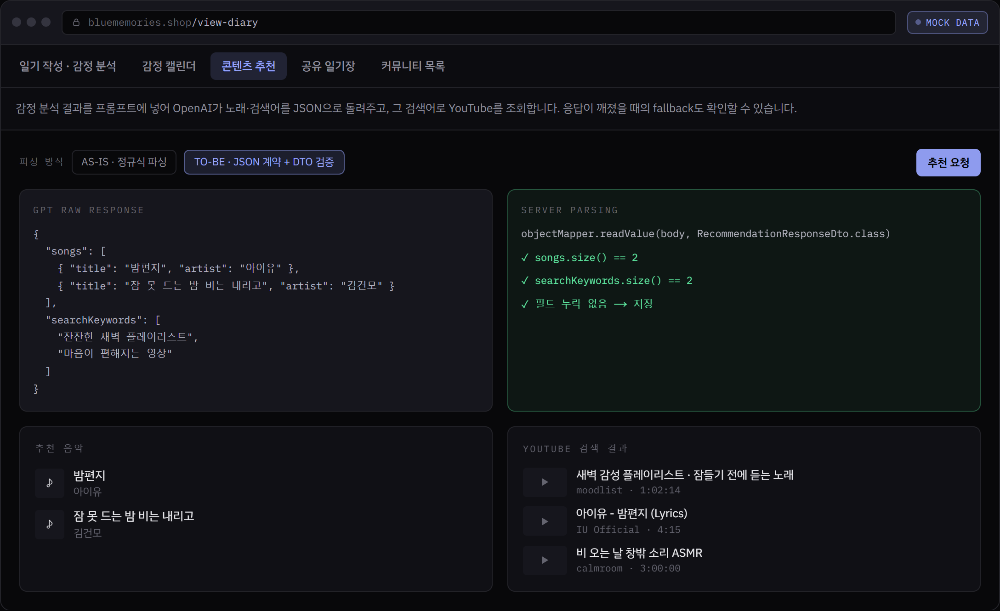
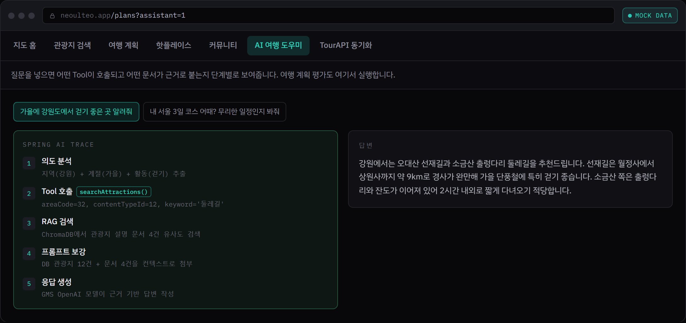
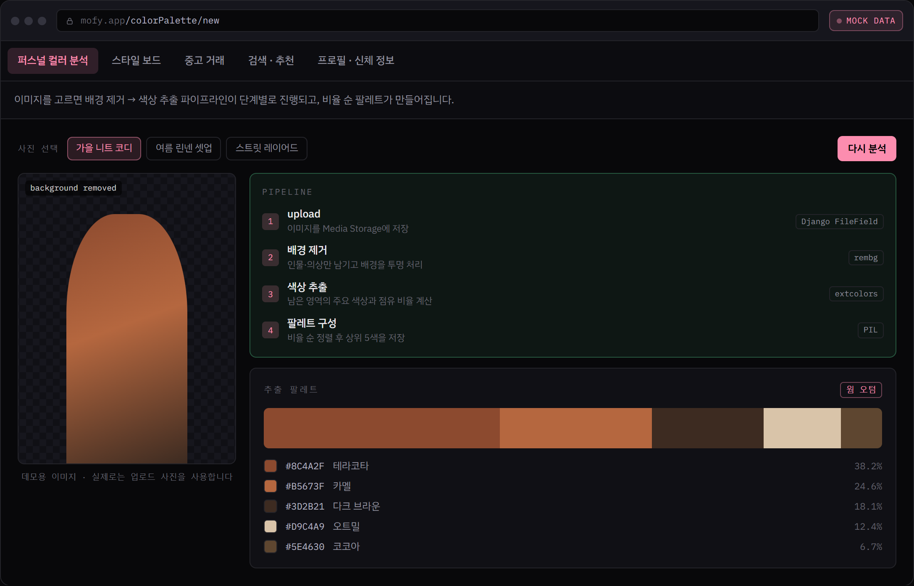

# 서영석 · Backend Developer Portfolio

프로젝트 6개를 아키텍처 · 트러블슈팅 · 성능 개선 중심으로 정리한 포트폴리오 사이트입니다.
각 프로젝트에는 **mock data로 동작하는 재현 데모**가 들어 있어, 백엔드 없이도 화면을 직접 조작해볼 수 있습니다.

- Next.js 16 (App Router) · React 19 · TypeScript · Tailwind CSS v4
- 외부 API·DB·환경변수 없음 → 정적 생성만으로 Vercel 배포 가능

---

## 데모 화면

아래 이미지는 모두 **실행 중인 페이지에서 데모를 직접 조작한 뒤 헤드리스 Chrome으로 캡처한 것**입니다. 목업이나 손으로 그린 그림이 아닙니다.

### SayBridge — WebRTC 검은 화면 재현

`addTrack` 이전에 `createOffer`를 실행하는 "수정 전" 순서를 고르면, SDP에 m-line이 빠져 상대 화면이 검은 화면으로 남는 상황이 그대로 재현됩니다.



### SayBridge — N+1 제거 전후

조회 방식을 전환하면 발생하는 쿼리가 로그에 그대로 쌓입니다. 게시글 6건 기준 7건 → 1건.



### Glople — 키워드 비트마스크

선택한 키워드가 비트마스크로 바뀌고, 여행지 마스크와의 AND 연산 결과와 `bitCount` 점수가 함께 표시됩니다.



### BlueMemories — GPT 응답 파싱

정규식 파싱과 JSON 계약을 전환해볼 수 있습니다. 형식이 흔들린 응답에서 정규식이 실패하고 fallback으로 넘어가는 과정이 보입니다.



### Neoulteo — Spring AI Tool Calling

질문을 넣으면 의도 분석 → Tool 호출 → RAG 검색 → 프롬프트 보강 → 응답 생성 순서가 단계별로 재생됩니다.



### MOFY — 퍼스널 컬러 추출

배경 제거(rembg) → 색상 추출(extcolors) 파이프라인이 진행되고 비율 순 팔레트가 만들어집니다.



---

## 실행

```bash
npm install
npm run dev
```

http://localhost:3000

```bash
npm run build   # 프로덕션 빌드 (전 페이지 정적 생성)
npm run start   # 빌드 결과 실행
npm run lint
```

---

## Vercel 배포

이 저장소를 GitHub에 올린 뒤 [vercel.com/new](https://vercel.com/new)에서 import 하면 됩니다.
Next.js 프로젝트로 자동 인식되므로 **설정을 바꿀 필요가 없습니다.**

| 항목 | 값 |
| --- | --- |
| Framework Preset | Next.js (자동 감지) |
| Build Command | `next build` (기본값) |
| Output Directory | 기본값 |
| Environment Variables | **없음** |

CLI로 배포하려면:

```bash
npx vercel
```

---

## 구조

```text
src/
├─ app/
│  ├─ page.tsx                 # 홈 (소개 · 기술 스택 · 프로젝트 · 연락처)
│  ├─ projects/[slug]/page.tsx # 프로젝트 상세 (데이터로 전부 렌더링)
│  ├─ layout.tsx
│  └─ globals.css              # 디자인 토큰 (@theme)
├─ content/
│  ├─ types.ts                 # Project 콘텐츠 모델
│  ├─ profile.ts               # 프로필 · 기술 스택
│  └─ projects/                # 프로젝트별 콘텐츠 (텍스트·수치·코드)
├─ mocks/                      # 데모용 mock data
└─ components/
   ├─ site/                    # 네비게이션 · 푸터
   ├─ ui/                      # Section, Chip, CodeCard, MetricPanel …
   ├─ demo/DemoShell.tsx       # 데모 공통 셸 (탭 · 브라우저 크롬 · Inspector)
   └─ demos/                   # 프로젝트별 데모 화면
```

### 내용을 고치려면

- **글·수치·코드 블록** → `src/content/projects/<slug>.ts`
- **프로필·기술 스택** → `src/content/profile.ts`
- **데모 데이터** → `src/mocks/<slug>.ts`
- **색상·타이포** → `src/app/globals.css`의 `@theme` 블록

프로젝트 상세 페이지는 `Project` 객체 하나로 렌더링됩니다.
프로젝트를 추가하려면 `src/content/projects/`에 파일을 만들고 `index.ts` 배열에 넣으면 됩니다.
데모까지 붙이려면 `src/components/demos/`에 컴포넌트를 만들고 `demos/registry.tsx`에 등록합니다.

---

## 수록 프로젝트

| # | 프로젝트 | 내용 | 데모 |
| --- | --- | --- | --- |
| 01 | **SayBridge** | 화상채팅 기반 외국어 교육 플랫폼 | 5화면 |
| 02 | **Glople** | MBTI 기반 여행지 추천 커뮤니티 | 5화면 |
| 03 | **BlueMemories** | AI 감정 기록 및 멘탈케어 커뮤니티 | 5화면 |
| 04 | **Neoulteo** | 공공 관광 데이터 기반 여행 계획 플랫폼 | 7화면 |
| 05 | **MOFY** | 퍼스널 컬러 기반 패션 커뮤니티·중고 거래 | 5화면 |
| 06 | **AWS Deploy** | 풀스택 배포 자동화 파이프라인 | 내용만 |

### 데모에서 직접 확인할 수 있는 것

트러블슈팅·성능 개선 사례를 읽는 데서 그치지 않고 화면에서 재현할 수 있게 만들었습니다.

- **SayBridge · 화상 수업** — `addTrack` 이전에 `createOffer`를 실행하도록 순서를 바꾸면 검은 화면이 그대로 재현됩니다
- **SayBridge · 과제 제출 현황** — 조회 방식을 N+1 / IN 배치로 전환하면 쿼리 로그와 쿼리 수가 달라집니다
- **SayBridge · 강의 탐색** — 필터를 조작하면 QueryDSL `BooleanBuilder` 조건이 실시간으로 조립됩니다
- **Glople · 키워드 필터** — 선택한 키워드가 비트마스크로 바뀌고 AND 연산 점수가 계산됩니다
- **Glople · 성향 추천** — 후보군 축소를 껐다 켜면 유사도 계산 건수와 정렬 방식이 달라집니다
- **BlueMemories · 콘텐츠 추천** — 정규식 파싱 / JSON 계약을 전환하면 파싱 실패와 fallback 동작을 볼 수 있습니다
- **BlueMemories · 커뮤니티 목록** — 전체 조회 / Pagination+Projection 전환에 따라 쿼리 수와 응답 크기가 바뀝니다

---

## 데이터에 대한 안내

- 사이트의 모든 데모는 **mock data**로 동작합니다. 실제 서비스 데이터가 아니며 백엔드에 연결되어 있지 않습니다.
- 성능 수치(Before/After)는 각 프로젝트에서 **JMeter로 실제 측정한 값**이며, 측정 조건을 함께 표기했습니다.
- 데모 화면의 쿼리 수·응답 시간은 이해를 돕기 위한 재현이며, 실측 조건과는 규모가 다릅니다(각 화면에 명시).
